# Conversa - MERN Chat Application


A full-stack MERN (MongoDB, Express.js, React.js, Node.js) chat application with Personal Chatbot. Conversa is a chat-app with various features like personalized chatbot which remembers the context, login, signup, profile photo uploading, dark and light mode, real-time chatting, message notifications, typing animation, message deletion, active/online status tracking, message seen status, and sending image messages with captions.

NOTE!!! if you want to use the given website please wait for 1 minute after logging in for the first time for the backend server to get restarted as it is a free server.

Guest User login accounts:
```
username : guestuser1@gmail.com, guestuser2@gmail.com
password: 1234guest
```


## Table of Contents

- [Features](#features)
- [Technologies Used](#technologies-used)
- [Getting Started](#getting-started)
  - [Prerequisites](#prerequisites)
  - [Installation](#installation)
- [Screenshots](#screenshots)
- [Usage](#usage)
- [Contributing](#contributing)
- [License](#license)

## Features

### Dark/Light Mode and Responsive Website
- Users can switch between dark and light themes for better readability and responsive website for dekstop and mobile.

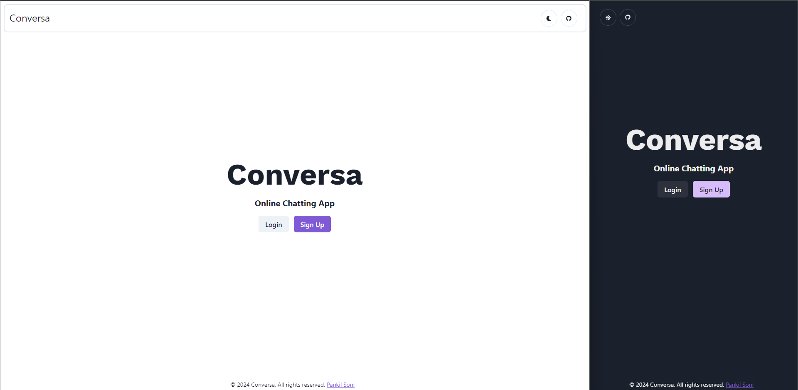

### Authentication
- Users can sign up, log in, and upload profile photos.
- Forgot password functionality is also available with OTP verification.


### Responsive Dashboard
- Different UI of dashboard for desktop and phone.

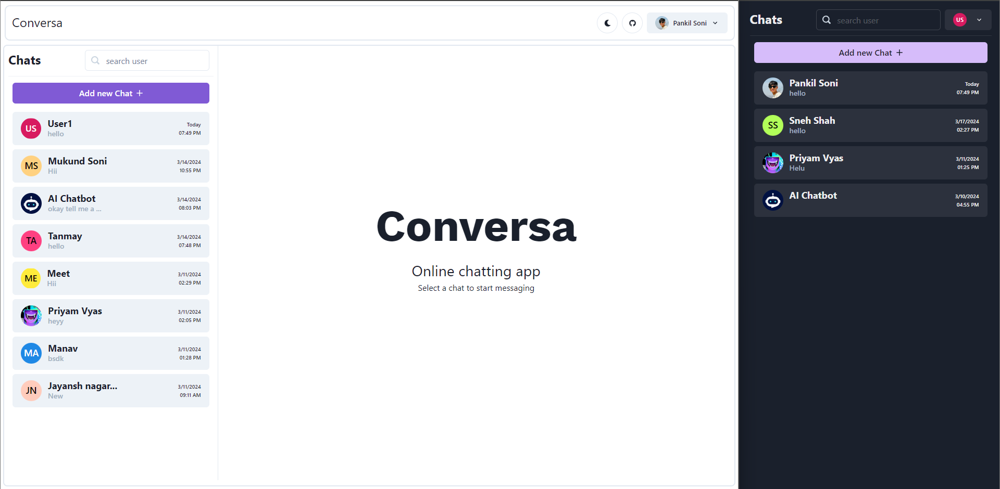

### New Chat
- Chatting with new users.

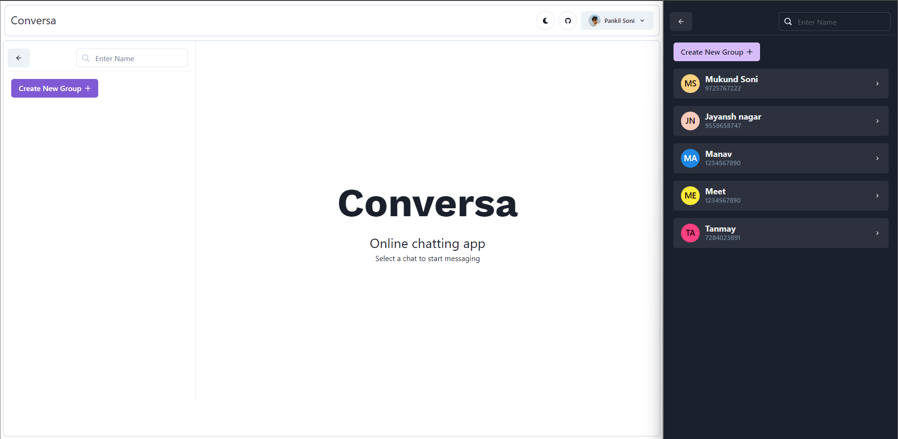

### Smooth Searching
- Search chats for easy access.

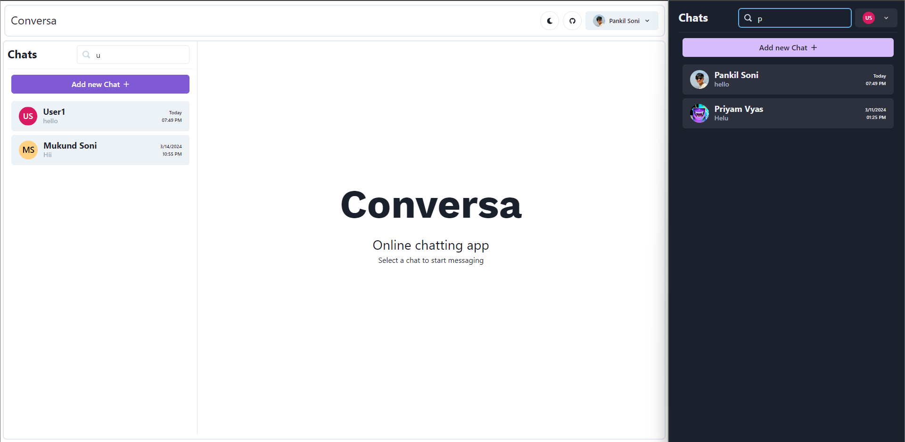

### Chatting Area & Real-time Communication
- Users can chat with friends or create new chats with anyone on the app.

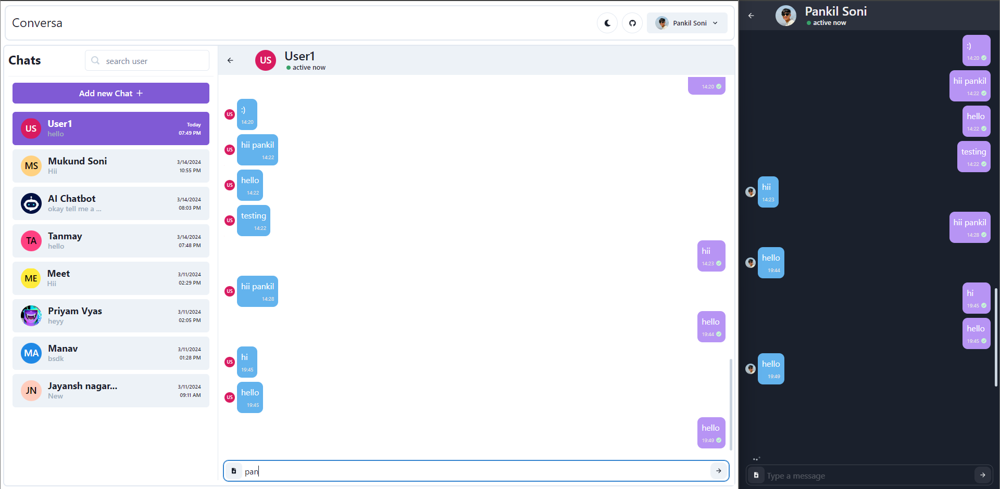

### New Message Real-time Notification
- Real-time messaging with notifications ensures seamless communication.

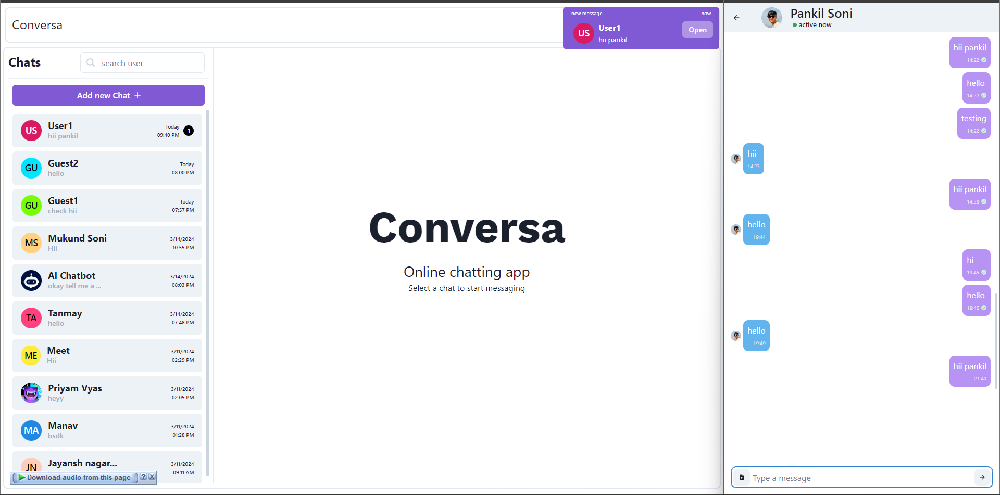

### Typing Animation
- Typing animation indicates when another user is typing a message.

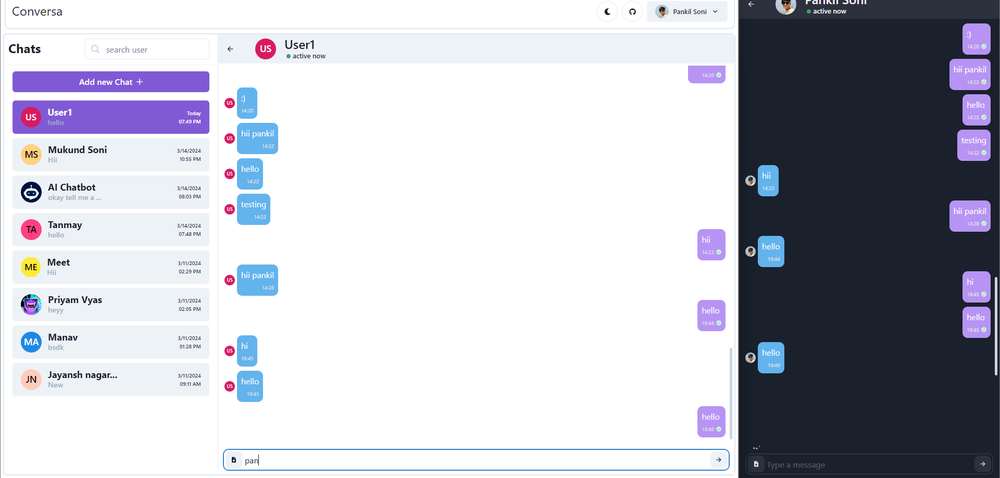

### Message Management
- Users can delete messages for themselves or for everyone in the chat.

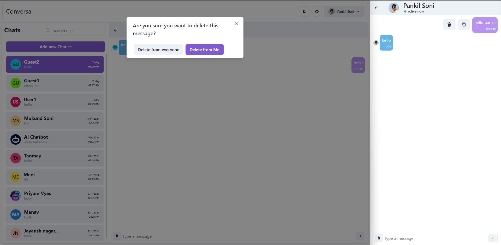

### Active Now Status
- Users can see the active status of their friends.


### Message Seen Status
- Users can see if their messages have been seen by the recipient.


### Personalized Chatbot
- Each user has a personalized chatbot that remembers previous chat contexts.

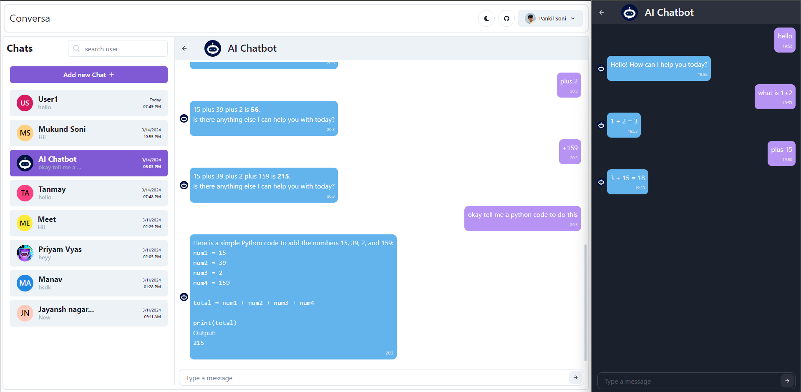

### Image Messages
- Users can send images as messages along with captions.

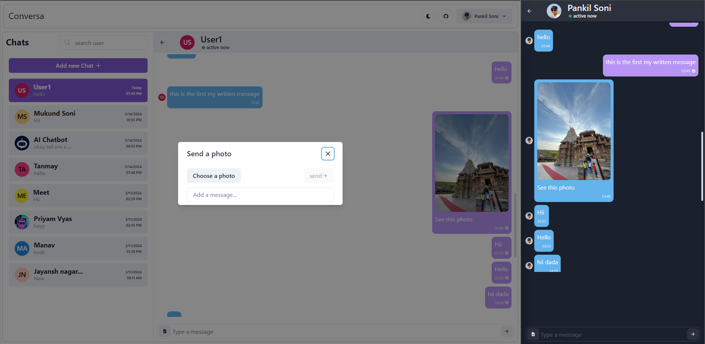

### Login using Otp
- Login using otp if user forgets the password

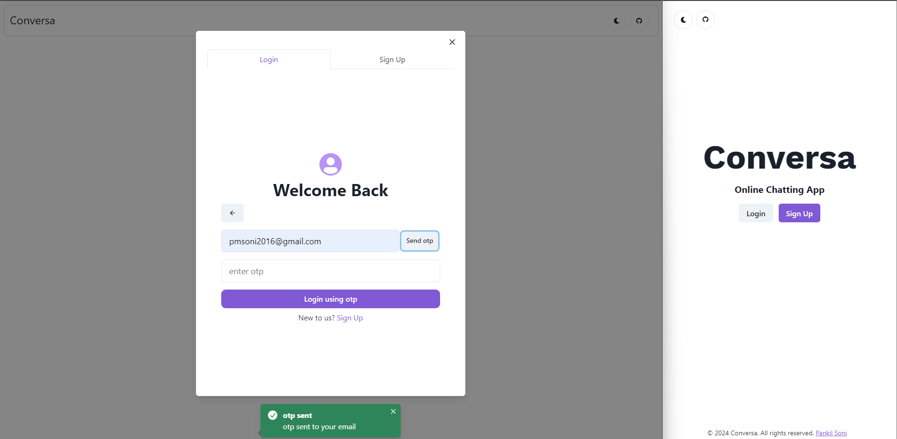

## Technologies Used


## Getting Started

### Prerequisites

- Node.js
- MongoDB
- Git

### Installation

1. Clone the repository:

   ```
   git clone https://github.com/yourusername/mern-chat-app.git
   ```
2. Navigate to the backend folder and frontend folter then install dependencies:
    ```
    cd backend
    npm install
    ```
    
    ```
    cd frontend
    npm install
    ```
    
3. Create a .env file in the backend folder and add necessary environment variables:
    ```
    PORT=5000
    GENERATIVE_API_KEY = ""
    MONGO_URI = ""
    EMAIL = ""
    PASSWORD= ""
    CLOUDINARY_ClOUD_NAME = ""
    CLOUDINARY_API_KEY = ""
    CLOUDINARY_API_SECRET = ""
    JWT_SECRET = ""
    AWS_ACCESS_KEY = ""
    AWS_SECRET = ""
    AWS_BUCKET_NAME = ""
    ```

## Usage
1. Start the backend server:
    ```
    cd backend
    npm install
    nodemon ./index.js
    ```
2. Start the frontend development server:
    ```
    cd frontend
    npm install
    npm run start
    ```
3. Open your browser and navigate to http://localhost:3000 to view the application.

## Contributing
Contributions are welcome! Please open an issue or submit a pull request.

## License
This project is licensed under the MIT License.

## About the Author 📝
This project was developed by **Pankil Soni**. Feel free to reach out with any questions or suggestions.
- gmail - pmsoni2016@gmail.com
- kaggle - https://www.kaggle.com/pankilsoni
- LinkedIn - https://www.linkedin.com/in/pankil-soni-5a0541170/
